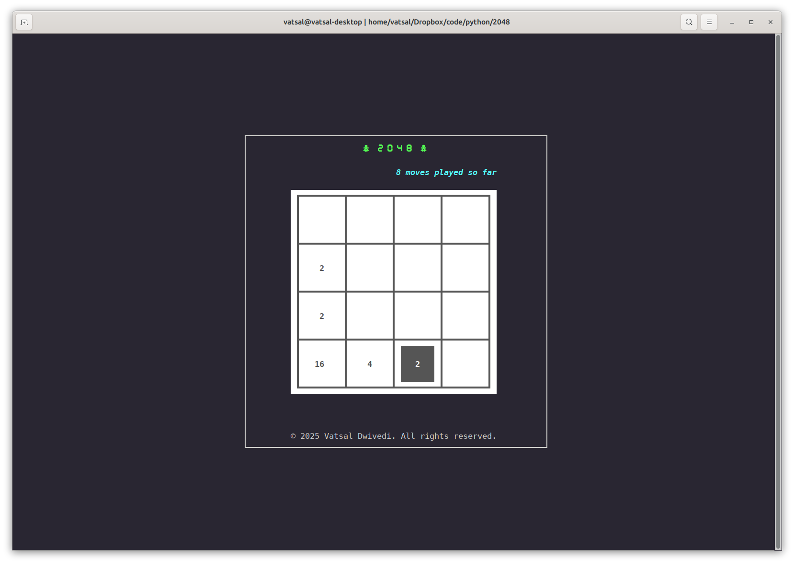

# 2048 with a terminal-based interface 

This repository contains an implementation of the tile-sliding game [2048](https://play2048.co/) by Gabriele Cirulli with a terminal interface based on the `curses` library. This module adds a single step undo and a wild tile to the block, which can be merged with any tile. The game can be invoked from the terminal as 

```
vatsal@qrcode>python -m play2048
``` 
A typical screenshot: 



The module can also be used to test solving algorithms by encoding the AI as the class `AIPlayer` with a function `AIPlayer.next_move(board)`, which takes as input a configuration of tiles encoded as an object of class `Board2048` (defined in `board.py`) and returns the next move as an integer 1,2,3,4 corresponding to up,left,down,right, respectively. 
